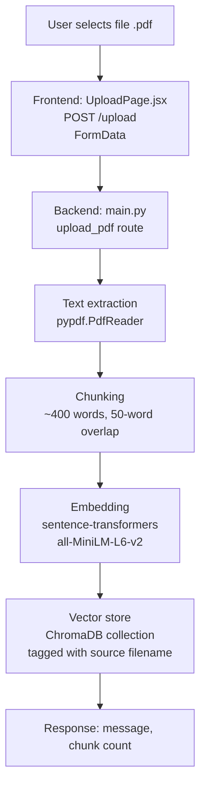
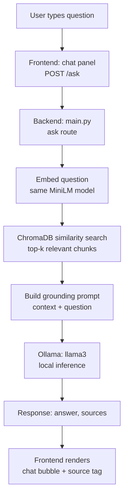
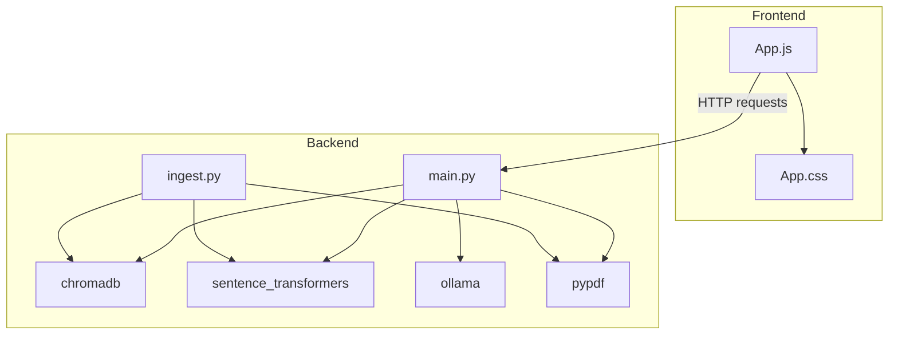

# Architecture

## Data flow diagrams

### Upload pipeline



### Query pipeline



## Module dependency graph



## Why these choices

- **ChromaDB** — lightweight, file-based, no separate server to run; ideal for a local, single-user tool.
- **sentence-transformers (MiniLM)** — small, fast, runs on CPU with no API cost, good enough quality for short documents like resumes.
- **Ollama + Llama 3** — avoids API keys and per-request cost entirely, at the expense of slower CPU-bound inference.
- **Chunk size (400 words, 50 overlap)** — balances context completeness against retrieval precision.

## Directory structure

```
ask-my-docs/
├── askmydocs/            # FastAPI backend
│   ├── main.py           # API routes: /upload, /ask
│   └── ingest.py         # Standalone ingestion script
├── frontend/             # React frontend
│   └── src/
│       ├── App.js
│       └── App.css
├── README.md
├── RUN.md
├── ARCHITECTURE.md
└── INTERVIEW.md
```

## Known limitations

- Single active document at a time (uploading a new PDF replaces the previous one)
- No conversation memory between questions yet
- CPU-only inference is slow (20-40s per answer)

## Possible extensions

- Multi-document support with per-source filtering
- Conversation memory for follow-up questions
- Re-ranking retrieved chunks before generation