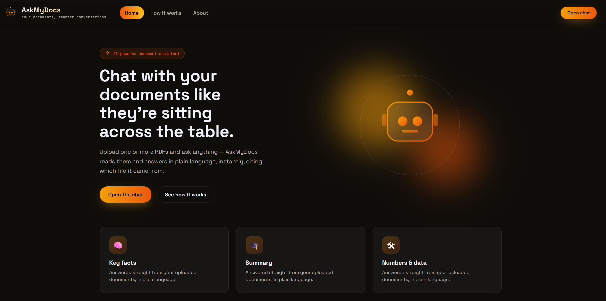
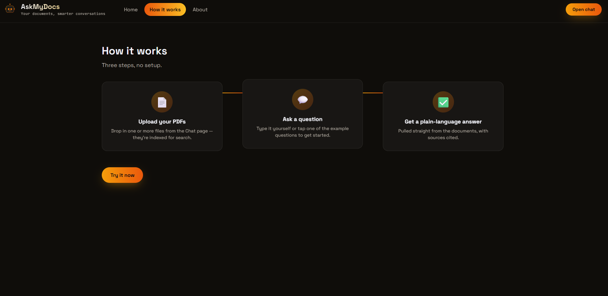
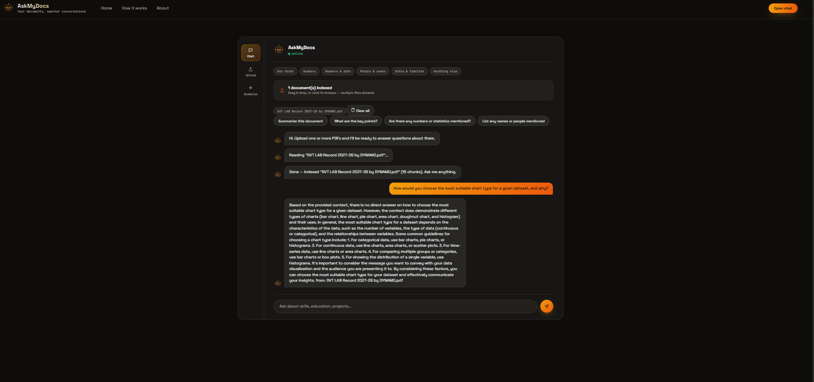
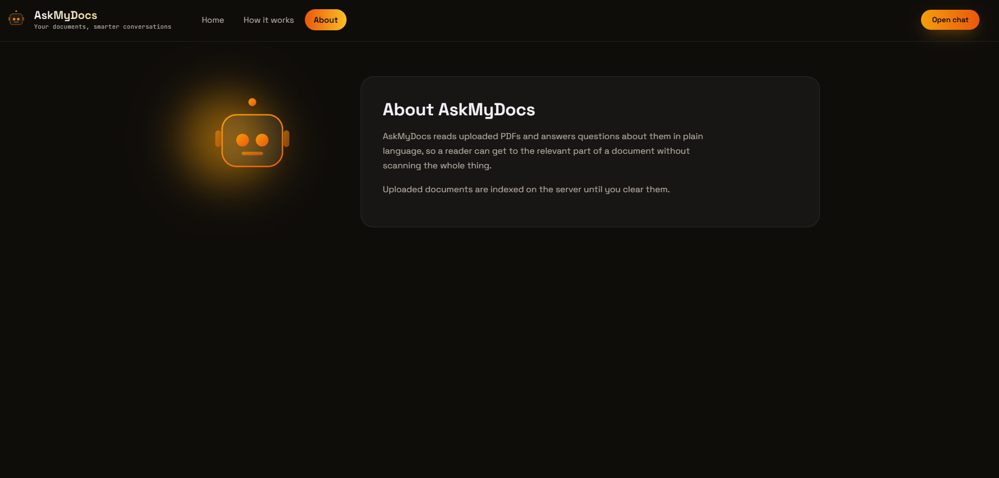

# Ask My Docs

AI-powered document Q&A system. Upload a PDF (resume, report, notes — anything), ask questions in plain English, and get answers grounded in the document's actual content.

## Features

- 📄 Upload any PDF and have it indexed instantly
- 💬 Ask natural-language questions and get grounded answers
- 🔍 Retrieval-Augmented Generation (RAG) — answers are backed by real document content, not guesses
- 🖥️ Runs entirely locally using Ollama — no API keys, no cost, no data leaving your machine
- 📎 Source-aware — every answer notes which document it came from

## Tech stack

| Layer | Technology |
|---|---|
| Frontend | React |
| Backend | FastAPI (Python) |
| Embeddings | sentence-transformers (all-MiniLM-L6-v2) |
| Vector store | ChromaDB |
| LLM | Ollama (Llama 3, running locally) |
| PDF parsing | pypdf |

## How it works

1. A PDF is uploaded and its text is extracted
2. The text is split into overlapping chunks
3. Each chunk is converted into a vector embedding
4. Embeddings are stored in a local ChromaDB vector database
5. When a question is asked, it's embedded and matched against the most relevant chunks
6. The matched chunks + question are sent to a local LLM (Llama 3 via Ollama), which generates a grounded answer

See [ARCHITECTURE.md](./ARCHITECTURE.md) for a deeper breakdown.

## Getting started

See [RUN.md](./RUN.md) for full setup and run instructions.

## Project structure

```
askmydocs/
├── askmydocs/        # FastAPI backend
│   ├── main.py
│   └── ingest.py
├── frontend/          # React frontend
└── README.md
```
## Screenshots







